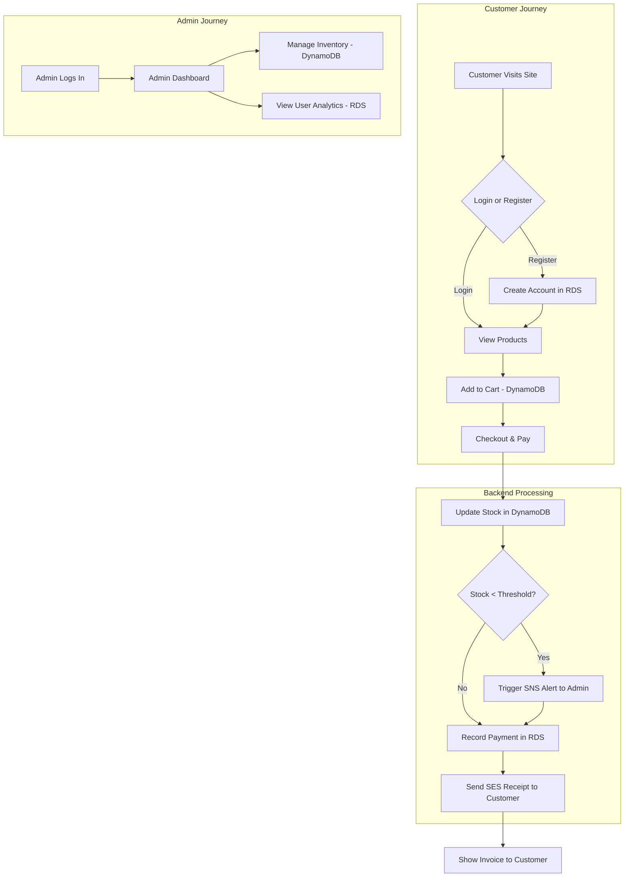

# 🚀 Retail Sync - Cloud-Native E-Commerce Application

[](https://www.python.org/) [](https://flask.palletsprojects.com/) [](https://aws.amazon.com/) [](https://www.docker.com/) [](#)

Retail Sync is a robust, cloud-native e-commerce platform built using Python (Flask) and deployed on AWS. It demonstrates a hybrid database architecture (SQL & NoSQL), serverless containerization (ECS Fargate), and automated cloud notifications (SNS & SES).

---

## ✨ Key Features

- **Hybrid Database Architecture:** Utilizes both AWS RDS (MySQL) for transactional data and DynamoDB for high-speed product and cart management.
- **Serverless Deployment:** Hosted on AWS ECS with Fargate for scalable, maintenance-free container orchestration.
- **Automated Notifications:** Integrated with AWS SNS for low-stock alerts to admins and AWS SES for sending beautiful HTML receipts to customers.
- **Admin & User Dashboards:** Separate, feature-rich interfaces for inventory management, user analytics, and customer shopping.
- **Dynamic Content:** Products, stock levels, and user data are fetched and updated in real-time.
- **Secure Authentication:** User registration and login with password hashing.

---

## 🧠 Tech Stack

| Component        | Technology                                          |
| ---------------- | --------------------------------------------------- |
| Language         | Python                                              |
| Web Framework    | Flask                                               |
| Cloud Platform   | AWS (ECS, ECR, RDS, DynamoDB, SNS, SES, CloudWatch) |
| Containerization | Docker                                              |
| Databases        | MySQL (via AWS RDS), NoSQL (via AWS DynamoDB)       |
| Frontend         | HTML, CSS, JavaScript                               |

---

## ⚙️ How It Works



---

## 🖥️ Screenshots

|               Login Page               |                    Admin Dashboard                    |              User Analytics               |
| :------------------------------------: | :---------------------------------------------------: | :---------------------------------------: |
|  |  |  |

---

## 📂 Project Structure

```bash
📦 Store-Sphere
 ┣ 📂 templates
 ┃ ┣ 📜 admin_dashboard.html
 ┃ ┣ 📜 bill.html
 ┃ ┣ 📜 index.html
 ┃ ┣ 📜 payment.html
 ┃ ┣ 📜 register.html
 ┃ ┣ 📜 user_dashboard.html
 ┃ ┗ 📜 view_users.html
 ┣ 📂 Screenshots
 ┃ ┣ 📜 ... (Images)
 ┣ 📜 app.py             # Main Flask Application
 ┣ 📜 Dockerfile
 ┣ 📜 requirements.txt
 ┗ 📜 README.md
```

---

## 🚀 Deployment Instructions (AWS ECS)

### Prerequisites

- AWS CLI configured.
- Docker installed.
- `requirements.txt` generated.

### Steps

1.  **Containerize**:
    - Build Docker image: `docker build -t storesphere .`
2.  **Push to ECR**:
    - Tag image: `docker tag storesphere:latest <aws_account_id>.dkr.ecr.<region>.amazonaws.com/storesphere-repo:latest`
    - Push: `docker push ...`
3.  **Deploy on ECS**:
    - Create a Task Definition in ECS (Fargate type).
    - Assign Task Role with permissions: `AmazonDynamoDBFullAccess`, `AmazonRDSFullAccess`, `AmazonSNSFullAccess`, `AmazonSESFullAccess`.
    - Create a Cluster and Run the Service.
    - Access via the Public IP on port 5000.

---

## 🔌 API Endpoints

- `POST /api/signup` - Create user in RDS.
- `POST /api/login` - Verify user/admin.
- `GET /api/products` - Fetch inventory from DynamoDB.
- `POST /api/cart` - Add/Update cart items in DynamoDB.
- `POST /api/record_payment` - Process transaction, update RDS, trigger SNS/SES.
- `GET /api/get_users` - Fetch user analytics for Admin.

---

## 🤝 Contributing

Contributions are welcome! Please feel free to fork the repository, make changes, and open a pull request.

---

**👨‍💻 Developed by Namish**


